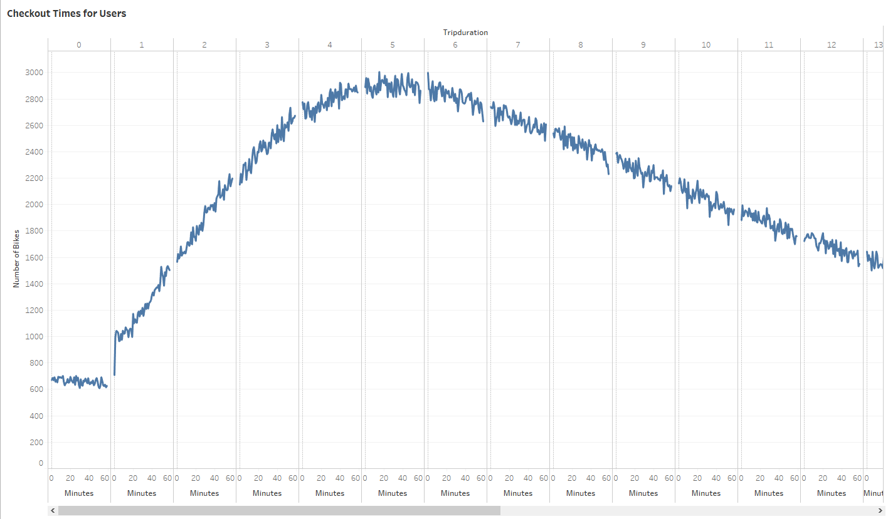

# bikesharing
## 1. Overview
Citibike runs a bikesharing service in New York City. They are looking to expand the services in other cities around the country and found an angel investor in Des Moines, IA.

The bikesharing project is to analyze New York city [data](https://s3.amazonaws.com/tripdata/index.html/201908-citibike-tripdata.csv.zip) from **August 2019** and then create a proposal on how it may work in Des Moines, IA.

**Tableau is used to import, style and portray data accurately using worksheets and dashboards.**

## 2. Results

The tableau worksheets and dashboards can be found at:

[Link to the dashboard](https://public.tableau.com/profile/nitu1096#!/vizhome/NYCCitibikeAugustRidership/RiderInfo?publish=yes)

### 2.1. Rider Information:
We start the analysis by looking at rider information.

From the data, it looks like Men use the ride sharing bike services more than women. 

And Subcribers use the services more than one time customers.

### 2.2 Usage Pattern by Hour
Secondly, we look at what are the peak hours for usage of bikes.

From the chart below, it can be determined that the bikes are used most between hours of 5 - 7 PM. 

 

Looking at the hourly data for each day of week further confirms that 5-7 PM peak hours is consistent through out the week. It is also observed that Monday through Friday, bikes usage is high during hours of 8-10 AM. 

On Saturdays and Sundays the bikes are used throughout the day. 

It is also interesting to observe that on Thursday, in spite of being a working day, the bike usage during hours of 5 - 7PM is higher.

### 2.3 Bike Checkout Times
The following charts show the bike check out times for Overall users and broken down by gender.

The first chart show that typically the bikes are checked out for 4-6 hours. 

From the second chart, it can be determined that both male and female users have the same checkout pattern.

### 2.4 Bike usage by Gender by Weekday
The following heat map confirms the fact the men and women have same pattern of bike usage through out the week.

### 2.5 Bike usage by User type by Weekday
The following heatmap depicts the bike usage throughout the week for each user type broken down by gender.

Based on the chart below, one can determine that male subscribers are the largest users of the bikes. For Customer user type, there is not much difference in the usage pattern between men and women.

## Summary

The main points that can be derived from the above analysis are:
1. Men use the bikesharing service more than women.
2. It pays to convert customers to subscribers as latter tend to use the services more.
3. The bike usage is more during off working hours, like weekends and before 10 AM and after 5 PM during weekdays.

Although looking at the August data on the bike sharing service in New York City gave some insights into how the service is used, I would like to delve deeper into few more aspects of this service to strengthen the proposal.
1. To make the bike sharing service a viable business through out the year, it is important to look into data for other months too. I would recommend performing data analysis on a yearly data to see if seasons, school calendars, major holidays etc has any effect on the usage of the service.
2. Also, we know that New York city is a very populous city with high traffic. So it makes sense that users in NYC use bikes to get from one place to other. To replicate the same success in Des Moines I would recommend to perform data analysis on Des Moines, IA population density and traffic patterns to see if it proportionate with that of NYC.

